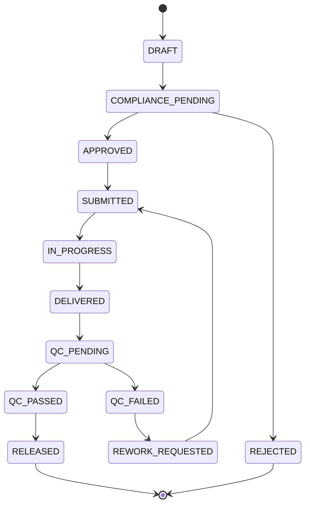

**MolecularGPT** — платформа мульти‑модального молекулярного дизайна и “experiment operations”: от постановки научной цели и генерации кандидатов до предиктивной оценки, формирования производственных спецификаций (**UnifiedManifest**) и возврата результатов контроля качества (**QC**) в единый **Experiment Graph**.

> ⚠️ Важно
>
> * MolecularGPT **не является лабораторной инструкцией** и **не публикует пошаговые протоколы синтеза/производства**.
> * Платформа формирует **спецификации и заказы** для лицензированных/сертифицированных производственных контуров (подрядчики, LIMS/ELN/ERP), получает статусы и QC‑артефакты, обеспечивает воспроизводимость, аудит и комплаенс.

---

## Содержание

* [1. Что решает MolecularGPT](#1-что-решает-moleculargpt)
* [2. Ключевые принципы](#2-ключевые-принципы)
* [3. Возможности и типы продуктов](#3-возможности-и-типы-продуктов)
* [4. Архитектура системы](#4-архитектура-системы)
* [5. Синхронизация «всех нейронок»](#5-синхронизация-всех-нейронок)
* [6. UnifiedManifest и типы манифестов](#6-unifiedmanifest-и-типы-манифестов)
* [7. Пайплайны: Design → Test → Learn](#7-пайплайны-design--test--learn)
* [8. Интеграция с Nanome MARA / Nanome XR](#8-интеграция-с-nanome-mara--nanome-xr)
* [9. Структура репозитория](#9-структура-репозитория)
* [10. Быстрый старт (dev)](#10-быстрый-старт-dev)
* [11. Кастомизация и расширения](#11-кастомизация-и-расширения)
* [12. Наблюдаемость, качество, воспроизводимость](#12-наблюдаемость-качество-воспроизводимость)
* [13. Безопасность и комплаенс](#13-безопасность-и-комплаенс)
* [14. Roadmap: развитие проекта](#14-roadmap-развитие-проекта)
* [15. Дисклеймеры и лицензия](#15-дисклеймеры-и-лицензия)

---

## 1) Что решает MolecularGPT

В R&D цепочка часто «рвётся» между:

* постановкой цели/гипотез,
* генерацией кандидатов,
* структурной проверкой,
* оценкой ADMET/рисков,
* принятием решения,
* выпуском спецификации на производство,
* получением QC и результатов био‑тестов,
* запуском следующей итерации.

MolecularGPT объединяет это в управляемый контур **design → test → learn**, где:

* каждая итерация имеет единый **correlation_id**,
* все расчёты версионируются и воспроизводимы,
* результаты (файлы/таблицы/структуры) живут как артефакты,
* решения логируются и объясняются.

---

## 2) Ключевые принципы

1. **Единая точка правды**

   * **Experiment Graph (EG)**: смысловая правда (что делаем и почему)
   * **Run Ledger**: техническая правда (чем посчитано, параметры, хэши, где лежит результат)

2. **Синхронизация через события и артефакты**

   * модели/сервисы не общаются напрямую (модель↔модель), а через **Event Bus**
   * данные передаются через **artifact_refs** (S3/MinIO), а не «в теле сообщений»

3. **Плагинная модель**

   * любая модель/сервис подключается через **Adapter API** с единым контрактом

4. **Политика “двух судей” и Uncertainty Gates**

   * критичные выводы требуют минимум 2 независимых подтверждений
   * решения учитывают неопределённость

5. **Manifest‑подход для “финального синтеза”**

   * система выпускает спецификацию (manifest) и запускает заказ в производственный контур
   * возвращает QC обратно в EG

---

## 3) Возможности и типы продуктов

MolecularGPT поддерживает режим **(D) “всё сразу”**, но через **разные manifest‑типы**:

* **Small molecules** (малые молекулы)
* **DNA constructs** (ДНК/конструкции)
* **Protein / Peptide** (белки/пептиды)
* **RNA** (РНК)
* **Complex / Mixed** (цепочки заказов и наборы)

Роли «нейрослоя» (примерный состав):

* **LLM‑оркестратор** (Gemini‑класс): цель, план, объяснимость, принятие решений
* **Генератор** (MegaSyn‑класс): генерация библиотек и multi‑objective оптимизация
* **Структурный предиктор** (AlphaFold‑класс): структурные гипотезы комплексов/взаимодействий
* **ADMET/Tox**: фильтры пригодности и безопасности
* **Docking/Rescoring / Physics**: независимый второй судья
* **Synth feasibility / retrosynthesis scoring**: оценка осуществимости изготовления (без рецептов)
* **Novelty/IP (опционально)**: проверка новизны/близости к известному

---

## 4) Архитектура системы

### 4.1 Высокоуровневая схема

```mermaid
flowchart TD
  UI[UI / API (BFF)] --> EG[Experiment Graph Service]
  UI --> RL[Run Ledger Service]

  EG <--> BUS[(Event Bus)]
  RL <--> BUS

  EG --> WF[Workflow Orchestrator]
  WF --> MG[Model Gateway]
  MG --> MA[Model Adapters]

  MA --> AS[(Artifact Store: S3/MinIO)]
  RL --> AS

  WF --> VB[Vendor/LIMS Gateway]
  VB --> AS

  VB --> QC[QC Ingestion]
  QC --> EG
  QC --> REL[Release Engine]
  REL --> EG

  XR[Nanome XR Plugin] <--> XRGW[Nanome XR Gateway]
  XRGW --> AS
  XRGW --> BUS

  MARA[Nanome MARA] <--> MARAB["mara-bridge" / mara-client]
  MARAB --> BUS
  MARAB --> EG
  MARAB --> WF
```

### 4.2 Control / Event / Data Planes

* **Control Plane**: Workflow Engine (Temporal/Argo/Prefect)

  * DAG, retries, таймауты, компенсации, планирование GPU/CPU

* **Event Plane**: Message Bus (Kafka/NATS/RabbitMQ)

  * события фактов, schema_version, idempotency_key

* **Data Plane**:

  * Postgres: EG + индексы + статусы
  * Postgres/ClickHouse (опц.): Run Ledger аналитика
  * S3/MinIO: артефакты (структуры, таблицы, отчёты, QC)
  * Redis (опц.): кэш и rate limiting

---

## 5) Синхронизация «всех нейронок»

### 5.1 Единый идентификатор итерации

Везде используется:

* `project_id`
* `iteration_id`
* `correlation_id` (сквозной)

Принцип: **один correlation_id = один “энд‑ту‑энд прогон”** (от intent до release).

### 5.2 Event контракт (обязательные поля)

Каждое событие обязано содержать:

* `event_type`
* `schema_version`
* `timestamp`
* `correlation_id`
* `project_id`, `iteration_id`
* `node_id` (ссылка на узел EG)
* `idempotency_key`
* `artifact_refs[]`
* `provenance`:

  * `actor` (сервис/пользователь)
  * `model_id` / `tool_id` (если применимо)
  * `model_version`

### 5.3 Model Adapter API (контракт)

Любая модель подключается через Adapter:

* `capabilities()`
* `submit(job)` → `job_id`
* `status(job_id)` → progress + partials
* `result(job_id)` → artifacts + metrics + uncertainty + explanations

Результат нормализуется в **Run Ledger** и связывается с EG.

### 5.4 Политика “двух судей”

Критичные решения (например, финалисты в manifest) требуют:

* минимум **2 независимых подтверждений** ключевой гипотезы
* при конфликте: доп. расчёт или human review

### 5.5 Uncertainty Gates

Если неопределённость выше порога:

* кандидат не попадает в manifest без доп. проверок
* либо маркируется как `exploratory`

---

## 6) UnifiedManifest и типы манифестов

### 6.1 Что такое UnifiedManifest

**UnifiedManifest** — типизированный контейнер спецификаций «что произвести / что опубликовать / что исполнить», который:

* фиксирует design‑freeze (версии моделей, артефакты, причины)
* задаёт требования QC (без протоколов)
* несёт compliance‑теги и approvals
* запускает производственные/инструментальные заказы

### 6.2 Общие поля

* `manifest_id`, `project_id`, `iteration_id`, `correlation_id`
* `product_type`
* `design_freeze`:

  * `candidate_ids[]`
  * `model_versions[]`
  * `artifact_refs[]`
  * `approvals_required[]`
* `quality_targets` (требования к QC)
* `compliance` (policy tags, проверки)

### 6.3 Подтипы

* `SmallMoleculeManifest`
* `DNAConstructManifest`
* `ProteinPeptideManifest`
* `RNAManifest`
* `MixedManifest` (цепочки/наборы)

### 6.4 Служебные манифесты интеграций

* `MaraWorkflowManifest` — выполнение tool/workflow в Nanome MARA
* `NanomeXRPublishManifest` — публикация структурных артефактов в Nanome XR + обратная синхронизация аннотаций

---

## 7) Пайплайны: Design → Test → Learn

### 7.1 Базовый цикл

1. **Intent & Constraints** (LLM‑оркестратор)
2. **Generate** (генератор)
3. **Filter** (валидность + первичные фильтры)
4. **Predict** (структуры/взаимодействия + независимые скоринги)
5. **Rank** (Scoreboard)
6. **Freeze** (заморозка финалистов)
7. **Manifest** (типизированная спецификация)
8. **Compliance Gate** (авто + ручные approvals)
9. **Order** (Vendor/LIMS Gateway)
10. **QC** (приём и валидация)
11. **Release** (публикация результата + автозапуск следующей итерации)

### 7.2 Стейт‑машина заказа



---

## 8) Интеграция с Nanome MARA / Nanome XR

Nanome MARA — это enterprise agentic layer для scientific informatics: tool/workflow‑оркестрация, интеграции корпоративных данных и безопасный контур за firewall. В MolecularGPT MARA подключается **не как “ещё одна модель”**, а как **оркестратор инструментов и внешний/внутренний ко‑пилот**.

### 8.1 Три режима интеграции

#### Режим A — MARA → MolecularGPT (MolecularGPT как Tool Provider)

**Когда использовать:** команда работает в MARA, а MolecularGPT вызывается как внешний инструмент для генерации/оценки/manifest.

Компонент:

* `services/mara-bridge/` (inbound)

  * принимает запросы (API key/SSO‑контекст)
  * валидирует политику и права
  * запускает workflow в MolecularGPT
  * возвращает `correlation_id`, статусы и `artifact_refs[]`

События:

* `mara.tool.invoked`
* `workflow.stage.completed`
* `workflow.completed`

#### Режим B — MolecularGPT → MARA (MARA как Tool Hub)

**Когда использовать:** в MARA уже собраны корпоративные workflow (конвертации/поиски/инструментальные цепочки), и их проще дергать из MolecularGPT.

Компоненты:

* `packages/sdk/mara-client/` (outbound)

  * `submit/status/result`
  * нормализует результат в наш формат `AdapterResult`

События:

* `mara.workflow.requested`
* `mara.workflow.completed`

#### Режим C — MolecularGPT ↔ Nanome XR (визуальная станция результата)

**Когда использовать:** структурные результаты, сравнение кандидатов и коллективная экспертиза “в 3D”.

Компоненты:

* `services/nanome-xr-gateway/`

  * публикация структур в XR
  * связывание с `candidate_id`/`prediction_id`
  * обратная синхронизация аннотаций

* `plugins/nanome-plugin-moleculargpt/` (Python)

  * получает payload и отображает структуры
  * отправляет аннотации обратно в MolecularGPT

События:

* `xr.publish.requested`
* `xr.publish.completed`
* `xr.annotation.created`

### 8.2 Общие правила синхронизации MARA ↔ MolecularGPT ↔ XR

* `correlation_id` обязателен и единый для:

  * MARA‑сессии/запроса
  * workflow в MolecularGPT
  * XR‑публикации

* `artifact_refs[]` — единственный канал “данных”: файлы лежат в S3/MinIO, события несут ссылки

* `schema_version` — на событиях и манифестах

* `idempotency_key` — на запуск workflow и XR‑публикацию

### 8.3 Как это отражается в Experiment Graph

Добавляются узлы:

* `ToolSession` (MARA): параметры вызова, результаты, ссылки на transcript/артефакты
* `XRSession` (Nanome): что опубликовано, кто участвовал, аннотации
* `Decision`: решения, обогащённые XR‑аннотациями

---

## 9) Структура репозитория

Рекомендуемая структура монорепозитория:

```
MolecularGPT/
  README.md
  docs/
    architecture/
    manifests/
    events/
    integrations/
      nanome-mara/
      nanome-xr/
    compliance/
    roadmaps/
  apps/
    ui/
    api/
  services/
    eg-service/
    run-ledger/
    workflow/
    model-gateway/
    scoreboard/
    compliance/
    vendor-gateway/
    qc-ingestion/
    release-engine/
    mara-bridge/
    nanome-xr-gateway/
  packages/
    schemas/
    sdk/
      mara-client/
    observability/
    utils/
  plugins/
    nanome-plugin-moleculargpt/
  infra/
    docker/
    k8s/
    terraform/
  examples/
    demo-pipelines/
    mock-adapters/
  tests/
    contract/
    integration/
    e2e/
```

---

## 10) Быстрый старт (dev)

### 10.1 Требования

* Node.js 18+ (рекомендуется pnpm)
* Docker (Postgres, MinIO, Event Bus)

### 10.2 Минимальная локальная инфраструктура

* Postgres: EG + метаданные
* MinIO: артефакты
* NATS/Kafka: события
* Redis (опционально)

### 10.3 Команды (пример)

* `pnpm i`
* `pnpm dev` — UI + API + базовые сервисы
* `pnpm test` — unit + contract

---

## 11) Кастомизация и расширения

### 11.1 Добавление модели

1. Реализовать `ModelAdapter` (submit/status/result)
2. Описать `capabilities` и `input_schema`
3. Зарегистрировать в `model-gateway`
4. Добавить contract tests

### 11.2 Добавление нового manifest‑типа

1. Добавить Zod/JSON‑schema в `packages/schemas`
2. Обновить `UnifiedManifest` union
3. Реализовать генератор + валидатор
4. Обновить Vendor/XR/MARA адаптеры
5. Повысить `schema_version` событий

### 11.3 Подключение Nanome MARA

* Inbound: `services/mara-bridge`
* Outbound: `packages/sdk/mara-client`
* Документация: `docs/integrations/nanome-mara/`

### 11.4 Подключение Nanome XR

* Gateway: `services/nanome-xr-gateway`
* Plugin: `plugins/nanome-plugin-moleculargpt` (Python)
* Документация: `docs/integrations/nanome-xr/`

---

## 12) Наблюдаемость, качество, воспроизводимость

* `trace_id = correlation_id` через все сервисы
* метрики:

  * latency per stage
  * queue depth
  * cache hit rate
  * failure rate
* воспроизводимость:

  * input/params hashing
  * pinning model versions
  * immutable artifacts

Тесты:

* contract tests: Model/Vendor/MARA/XR adapters
* integration tests: пайплайны
* schema tests: события и манифесты

---

## 13) Безопасность и комплаенс

Минимальный набор:

* RBAC (кто может запускать workflow/заказы/публикации в XR)
* allowlist внешних операций (MARA workflows, XR publish)
* аудит:

  * кто запустил
  * что именно отправлено
  * какие артефакты ушли/вернулись
* гейты:

  * freeze → manifest → external order → release

---

## 14) Roadmap: развитие проекта

### 14.1 Physics‑усиление

* MD stability checks
* MM/GBSA
* FEP (для финалистов)

### 14.2 Квантовые вычисления (точечно)

Реалистичный подход: квант как **отдельный Adapter** для подзадач:

* локальные квант‑химические оценки фрагментов/энергетик
* комбинаторная оптимизация в пространствах замен
* гибридные схемы (квантовые признаки → классический ранжировщик)

### 14.3 Active Learning

* использовать QC/биотесты как “gold feedback”
* drift detection + retraining workflows

### 14.4 Больше enterprise‑интеграций

* расширение MARA workflows
* расширение XR аннотаций и decision‑логики

---

## 15) Дисклеймеры и лицензия

* Проект предназначен для легитимных исследований и production‑контуров с соблюдением законов, норм, экспорт‑контроля и этики.
* Любые операции с реальными биологическими/химическими объектами выполняются компетентными специалистами и организациями.

